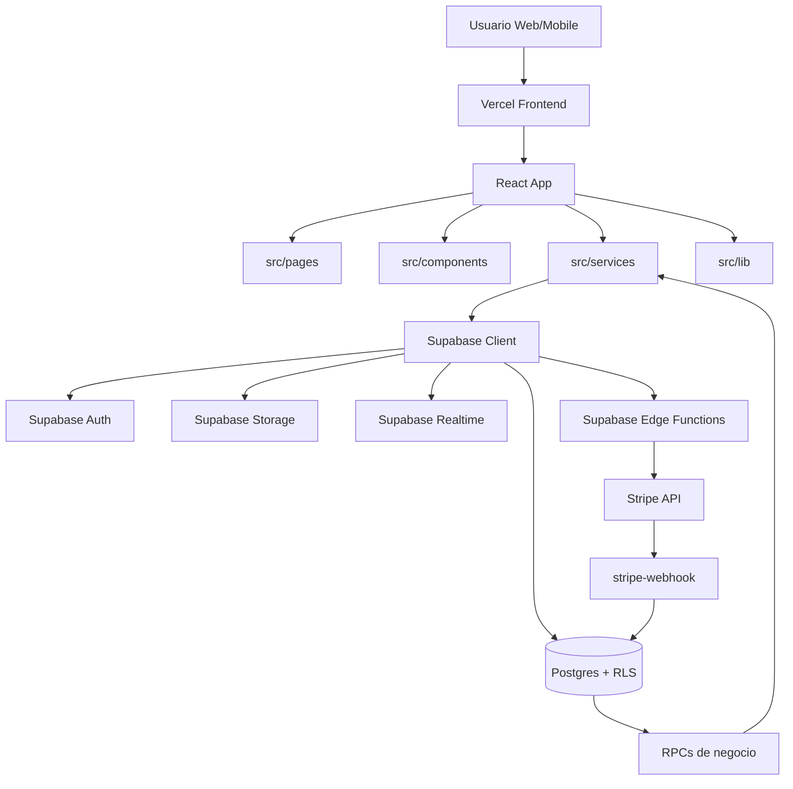
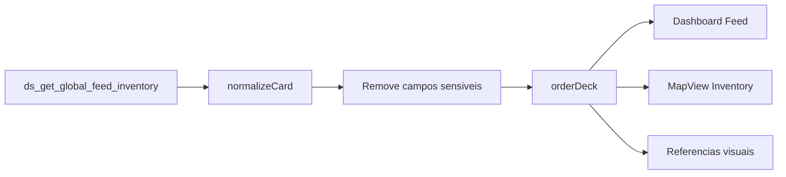
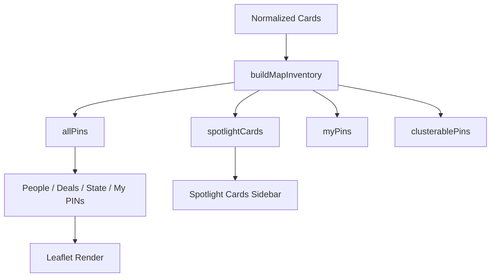
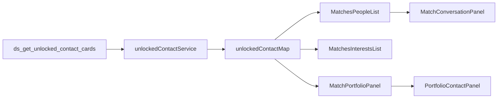
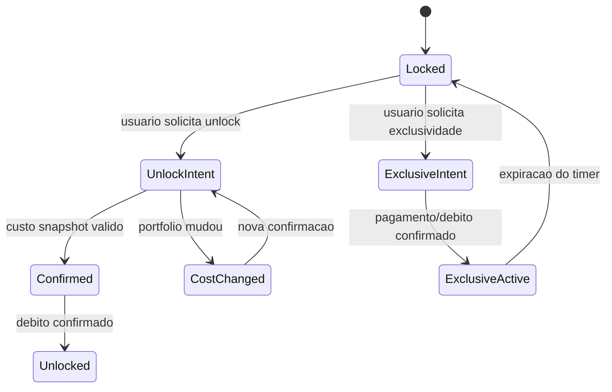
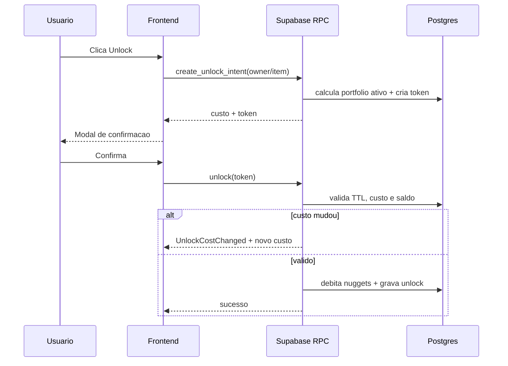
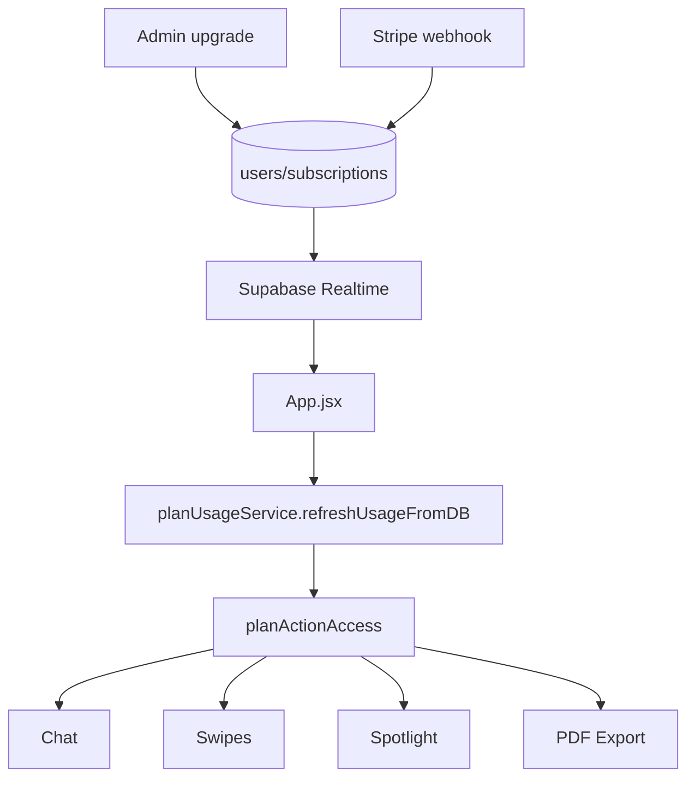
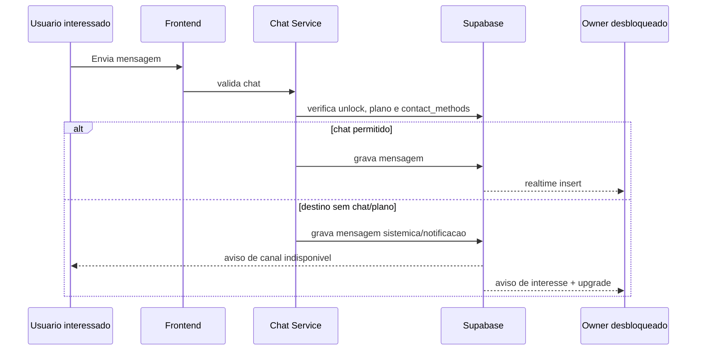
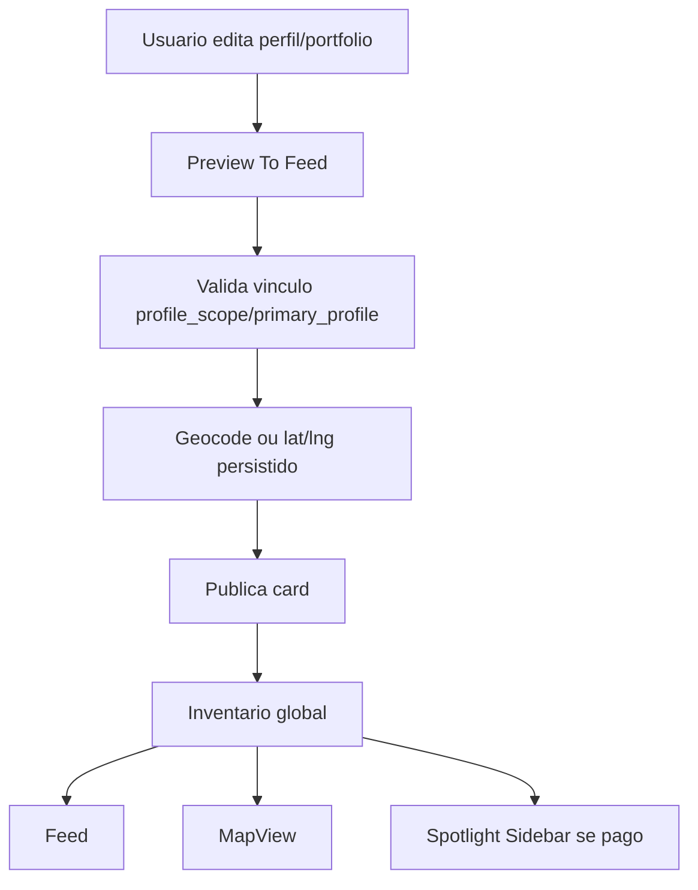
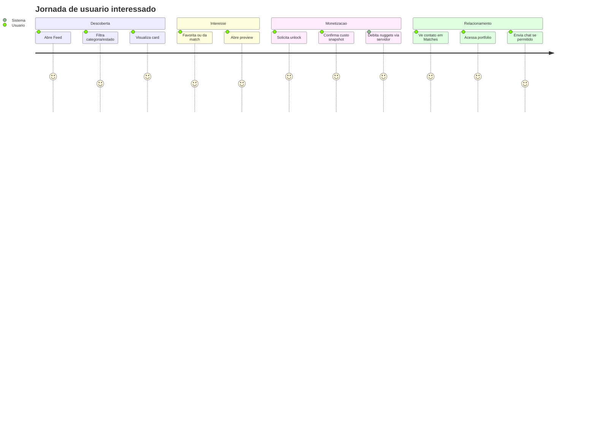

# DealSifter Match App Overview

Este documento descreve a sistematica geral do DealSifter Match: arquitetura, dominios funcionais, interacoes entre usuarios, regras criticas de negocio e fluxos principais. Ele deve ser usado como referencia de produto e engenharia antes de alterar Feed, Matches, MapView, pagamentos, desbloqueios, planos, suporte ou onboarding.

## 1. Objetivo Do App

DealSifter Match conecta usuarios do mercado imobiliario, incluindo investidores, wholesalers, FSBO owners, lenders, compradores, prestadores de servico e administradores. O app organiza oportunidades e contatos em tres experiencias principais:

- Feed: descoberta por cards, swipes, favoritos, matches, unlocks e spotlight.
- MapView: descoberta geografica por pins, filtros, clusters e cards em destaque.
- Matches: area de contatos desbloqueados, interesses, portfolio, chat e historico de relacionamento.

O modelo comercial combina saldo de nuggets, planos de assinatura, desbloqueio de contatos, exclusividade temporaria e destaque pago.

## 2. Stack E Blocos Principais

- Frontend: React 19 + Vite 7.
- UI: componentes em `src/components`, paginas em `src/pages`, tema em `src/theme` e `src/services/themeService.js`.
- Backend: Supabase Auth, Postgres, Storage, RPCs, Edge Functions e Realtime.
- Pagamentos: Stripe Checkout, Billing Portal, webhooks e fila de reprocessamento.
- Mapa: Leaflet / React Leaflet, inventario via `mapInventoryService`.
- Testes: Vitest.
- Deploy: Vercel.

## 3. Arquitetura Geral

## 4. Estrutura De Pastas

- `src/pages/`: telas principais do app.
- `src/components/`: UI reutilizavel, cards, modais, layout, paineis de Matches.
- `src/services/`: camada de servicos para regras runtime, Supabase, plano, unlock, chat, suporte, tema e inventario.
- `src/lib/`: funcoes puras, normalizacao, sanitizacao, regras de entitlement, formatadores e observabilidade.
- `src/hooks/`: hooks React para realtime, notificacoes, chat e responsividade.
- `src/i18n/`: traducoes e utilitarios de idioma.
- `supabase/migrations/`: schema, RLS e RPCs.
- `supabase/functions/`: Edge Functions.
- `docs/`: runbooks, QA, gaps, auditorias e documentacao operacional.

## 5. Dominios Funcionais

### 5.1 Auth E Sessao

Supabase Auth gerencia login por email/senha e provedores externos, incluindo Google. O app deve tratar:

- Confirmacao de email.
- Callback de autenticacao.
- Criacao/hidratacao do usuario.
- Consentimentos de termos e privacidade.
- Separacao de usuario novo vs usuario recorrente.

Regra: dados pagos, plano, unlocks e contatos desbloqueados nunca devem depender de `localStorage` como fonte de verdade.

### 5.2 Onboarding E Perfis

O usuario pode ter mais de um perfil ativo:

- Personal.
- Professional / Business.
- FSBO.

Cada perfil deve ser independente. Nome, avatar, estado, categoria, canais de contato e prioridade nao podem vazar de um perfil para outro.

Regra central:

- Qualquer perfil pode ser preenchido.
- Pelo menos um perfil valido deve existir para publicar cards.
- O campo de prioridade define qual perfil tem papel primario/secundario/terciario.
- Propriedades e servicos devem ser vinculados ao perfil correto por `primary_profile`, `profile_scope`, `owner_id` ou campo equivalente.
- Cards no Feed, MapView e Matches devem usar a identidade do perfil vinculado ao item, nao outro perfil do mesmo usuario.

### 5.3 Feed

O Feed apresenta cards de pessoas/servicos, spotlight e showcase/propriedades.

Regras importantes:

- Cards publicos nao podem conter email, telefone, WhatsApp ou canais privados.
- Cards proprios podem aparecer para visualizacao, mas nao devem ser selecionaveis como match/unlock.
- Cards ja desbloqueados pelo usuario nao devem continuar consumindo swipes do Feed como se fossem novos.
- Ordenacao e filtros devem passar por normalizacao unica.
- Spotlight deve priorizar exposicao visual, mas sem vazar contato privado.

Fluxo simplificado:

### 5.4 MapView

MapView exibe pins geograficos para perfis, servicos e propriedades.

Regras:

- Todos os pins devem derivar do mesmo inventario normalizado.
- `spotlightCards` deve ser subconjunto de `allPins`, nunca fonte paralela.
- `myPins` deve ser subconjunto de `allPins`.
- People/Deals/My PINs/Spotlight devem filtrar a mesma base.
- Geocoding nao deve depender de chamada client-side a provedores externos; lat/lng deve estar persistido no banco ou ser resolvido por Edge Function/backfill.
- Clusters devem expandir mantendo contagem correta.

### 5.5 Matches E Portfolio

Matches consolida contatos desbloqueados e propriedades de interesse.

Regras:

- Dados de contato desbloqueado devem vir de `unlockedContactService` e da RPC canonica `ds_get_unlocked_contact_cards`.
- `ContactButtons` deve ser apresentacional.
- `PortfolioContactPanel` deve ser o unico ponto de renderizacao de contato desbloqueado em Matches.
- Mobile, desktop e modal preview devem mostrar os mesmos dados para o mesmo entitlement.
- Se o owner foi desbloqueado, o portfolio completo desse owner fica visivel sem paywall adicional.
- Se apenas uma propriedade foi desbloqueada, o contato do owner fica visivel naquele contexto, mas outras propriedades podem continuar bloqueadas.

## 6. Regras De Unlock E Exclusividade

### 6.1 Unlock De Contato

Unlock simples de owner:

- Libera email/telefone/canais do owner.
- Libera portfolio completo do owner para visualizacao.
- Debita nuggets conforme snapshot de custo.
- Cria historico e notificacao persistente.

### 6.2 Unlock De Propriedade

Unlock de propriedade:

- Libera detalhes daquela propriedade.
- Libera contato do owner daquela propriedade.
- Nao necessariamente libera todas as demais propriedades do owner.

### 6.3 Exclusividade

Exclusividade:

- Bloqueia a propriedade para novos unlocks por terceiros durante a janela ativa.
- Se uma propriedade de um owner entra em exclusividade, cards associados ao mesmo contato devem respeitar o bloqueio temporario para nao vazar canais exclusivos por outro caminho.
- O comprador da exclusividade ve normalmente o contato e item exclusivo.
- Terceiros veem badge de exclusividade com timer, nao paywall generico.

## 7. Custo Snapshot De Unlock

O custo de desbloqueio e calculado no servidor para evitar divergencia entre o valor exibido e o valor debitado.

Fluxo:

1. Usuario clica para desbloquear.
2. RPC calcula custo no momento e cria token de intencao com TTL.
3. Frontend exibe o custo snapshot.
4. Usuario confirma com token.
5. RPC valida token, saldo e custo.
6. Se custo mudou, retorna erro e novo valor.
7. Se valido, debita nuggets e grava unlock.

## 8. Planos, Nuggets E Features

`planUsageService` e a camada de RPCs devem ser a fonte para decidir:

- Swipes diarios.
- Unlocks mensais.
- Matches ativos.
- Saldo de nuggets.
- Chat.
- Spotlight.
- Export PDF.
- Exclusividade.

Regras:

- Componentes nao devem decidir feature por `subscription.planId`, mocks ou `localStorage`.
- Upgrade por admin ou Stripe webhook deve refletir via Supabase Realtime sem refresh manual.
- `localStorage` pode existir para cache visual, mas nao para direito pago.

## 9. Stripe

Stripe controla:

- Compra de packs de nuggets.
- Assinaturas.
- Portal de billing.
- Webhooks financeiros.
- Reprocessamento de eventos fora de ordem.

Regras:

- Saldo so aumenta apos webhook confirmado.
- Frontend nunca deve ser fonte de KPI financeiro.
- Eventos Stripe devem ser idempotentes.
- Eventos fora de ordem devem ser logados e, quando aplicavel, reprocessados.

Referencias:

- `supabase/functions/stripe-webhook/`
- `supabase/functions/stripe-reprocess-queue/`
- `docs/RUNBOOK_STRIPE.md`
- `docs/QA_E2E_FLUXOS_FINANCEIROS.md`

## 10. Chat Usuario-Usuario

Chat interno depende de:

- Contato desbloqueado.
- Perfil destino ter DealSifter Chat como canal desejado.
- Ambos os lados terem plano com chat liberado.
- Notificacoes persistentes para mensagens e restricoes.
- Preferencia de idioma aplicada a mensagens sistemicas.

Se o remetente tem chat, mas o recebedor nao:

- Recebedor recebe aviso sugerindo upgrade.
- Remetente recebe aviso para usar canais alternativos disponiveis no perfil.

## 11. Suporte E Admin

O suporte opera com tickets/chat real, historico, status e mensagens rapidas.

Regras:

- Tickets abertos e resolvidos devem ficar separados.
- Historico de tickets por usuario deve ficar agrupado.
- Admin deve ver badges de mensagens nao lidas.
- Usuario deve poder clicar notificacao e voltar ao chat de suporte.
- Emails transacionais dependem de segredo `RESEND_API_KEY` quando usado envio real por provider.

Admin tambem gerencia:

- KPIs.
- Doacao de nuggets.
- Upgrade gratuito para Pro/Enterprise.
- Reprocessamento Stripe.
- Alertas operacionais.

## 12. Notificacoes

Notificacoes devem ser persistentes no banco quando tiverem valor operacional ou historico.

Tipos comuns:

- Unlock recebido.
- Exclusividade comprada.
- Chat/mensagem.
- Suporte.
- Spotlight expirado.
- Alertas de plano/feature.

Regras:

- Notificacoes nao somem apenas por serem clicadas.
- Devem poder ser marcadas como lidas.
- Devem poder ser excluidas individualmente ou em lote quando a UI permitir.
- Offline users devem ver backlog ao retornar.

## 13. i18n

Idiomas alvo:

- Ingles como padrao.
- Portugues.
- Espanhol.

Regras:

- Strings de UI devem passar por `translations.js` ou camada equivalente.
- Mensagens sistemicas persistidas devem preferir `message_code` + `params`, nao texto final fixo.
- Chat deve respeitar preferencias de idioma.
- Texto hardcoded em portugues dentro de componentes de UI e risco de producao.

## 14. Tema, Logo E PWA

Tema:

- Bootstrap inicial em `index.html` deve aplicar `data-theme` cedo para evitar flash.
- `themeService` controla leitura, aplicacao e toggle.
- Navbar e hamburger devem mostrar a acao oposta correta: se esta claro, oferecer escuro; se esta escuro, oferecer claro.

Logo:

- Mobile claro deve usar asset de tema claro.
- Mobile escuro deve usar asset de tema escuro.
- Desktop/tablet seguem o padrao visual existente.

PWA:

- Manifest deve ter nome, icones, display standalone e start URL.
- iOS nao oferece prompt nativo; mostrar instrucao manual.
- Android pode usar prompt nativo quando disponivel.

## 15. Privacidade, LGPD E Delecao De Conta

Regras:

- Soft-delete com auditoria.
- Anonimizar dados pessoais.
- Manter trilhas financeiras e de KPI sem expor PII.
- Cancelar assinatura ativa no Stripe se houver.
- Limpar ou agendar limpeza de arquivos em Storage conforme politica.
- Nao reidratar conta nova com dados antigos se email for reutilizado.

Referencias:

- `supabase/functions/delete-account/`
- `docs/POLITICA_DADOS_LGPD.md`

## 16. Observabilidade

Eventos importantes devem ser rastreaveis sem expor PII:

- Falha em RPC de unlock.
- Contato desbloqueado sem dados canonicos.
- Paywall indevido em owner desbloqueado.
- Stripe stuck/out-of-order.
- Falha de Edge Function.
- Erros de checkout.

Regras:

- Nunca logar email, telefone, token, senha ou dados sensiveis.
- User IDs e owner IDs em observabilidade externa devem ser hasheados.
- AdminDashboard deve consolidar alertas operacionais quando possivel.

## 17. Fluxo De Publicacao De Card

## 18. Fluxo De Descoberta E Conversao

## 19. Regras De Seguranca De Dados

- Cards publicos nunca carregam contato privado.
- `normalizeCard()` deve sanitizar campos sensiveis.
- Payloads de `user_feed_actions` nao devem armazenar email/telefone.
- Entitlement de contato vem da RPC canonica de unlock.
- Componentes visuais nao devem reconstruir contato por fallback.
- Dados mock devem ficar fora de producao ou ocultos quando nao houver backend real.

## 20. Checklist Antes De Alterar Areas Criticas

Antes de mexer em Feed, Matches, MapView, Unlock, Stripe, Chat ou Plano:

1. Identificar qual service/RPC e fonte canonica.
2. Confirmar se a UI nao esta usando `localStorage` como verdade.
3. Confirmar se dados publicos passam por sanitizacao.
4. Rodar `npm run lint`.
5. Rodar `npm run test`.
6. Rodar `npm run build`.
7. Se for visual/mobile, executar `docs/QA_DEPLOY_MOBILE.md`.
8. Se for financeiro/unlock, executar `docs/QA_E2E_FLUXOS_FINANCEIROS.md`.
9. Se for contatos desbloqueados, executar `docs/QA_UNLOCKED_CONTACTS_E2E.md`.
10. Se for MapView, executar `docs/QA_MAPVIEW_V2.md`.

## 21. Principios De Manutencao

- Um dado canonico deve ter uma unica fonte.
- Services encapsulam regra de negocio; paginas orquestram estado e renderizacao.
- Componentes exibem dados recebidos, nao decidem entitlement.
- Realtime atualiza estado operacional, mas banco/RPC continua sendo autoridade.
- Webhook Stripe e a fonte de verdade financeira.
- QA manual documentado e parte do processo, nao atividade opcional.
